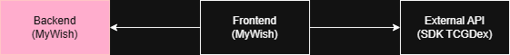

# MyWish API

Esse projeto foi gerado utilizando Java 21 (para compatibilidade do GraalVM) e [Quarkus CLI](https://quarkus.io/guides/cli-tooling) 3.30.3.

Ele representa uma API para persistência de dados referente ao funcionamento do 
[frontend (MyWish)](https://github.com/stephaniefay/s3-mvp-frontend) onde usuários podem salvar suas coleções e listas 
de desejo, bem como conferir as coleções/listas de desejos públicas de outros usuários.

Nesse momento essa solução representa apenas o MVP, o que significa que há ainda muitas outras alterações a serem feitas 
e features a serem adicionadas.

### Diagrama



### Swagger
A documentação, em swagger, pode ser encontrada no endpoint [http://localhost:8080/swagger/](http://localhost:8080/swagger/)
contanto que a aplicação esteja no ar e sejam usadas as configurações padrões passadas nesse ReadME.

## Execução

Existem várias maneiras para a execução do projeto, mas para fins avaliativos da pós (e para a facilidade de execução)
uma imagem nativa, de tamanho reduzido, foi gerada através do ambiente linux para a execução via docker.

### Docker build
Como informado acima, já que executaremos o docker utilizando a imagem nativa (e portanto totalmente contida) basta executar
o código abaixo.

```shell script
docker build -f src/main/docker/Dockerfile.native -t s3-mvp-backend .
```

E assim que a finalização do build acontecer, rodar com:
```shell script
docker run -i --rm -p 8080:8080 s3-mvp-backend
```

A imagem já estará buildada inclusive com o H2 (utilizado para a construção do MVP) já embutida. Então o banco estará inicializado
com algumas informações. Após encerrar a imagem, se houver outra execução (ou mesmo execução paralela) o banco será resetado
para o arquivo dentro do diretório ``/data`` na raiz do projeto.

### Execução local
Você também pode executar a aplicação localmente utilizando os scripts abaixo, contanto que tenha o 
[Quarkus CLI](https://quarkus.io/guides/cli-tooling) instalado na máquina.

```shell script
./mvnw quarkus:dev
```

> **_Nota:_**  Quarkus, no modo DEV, já vem com uma Dev UI, que estará disponível no endpoint
> <http://localhost:8080/q/dev/>.

